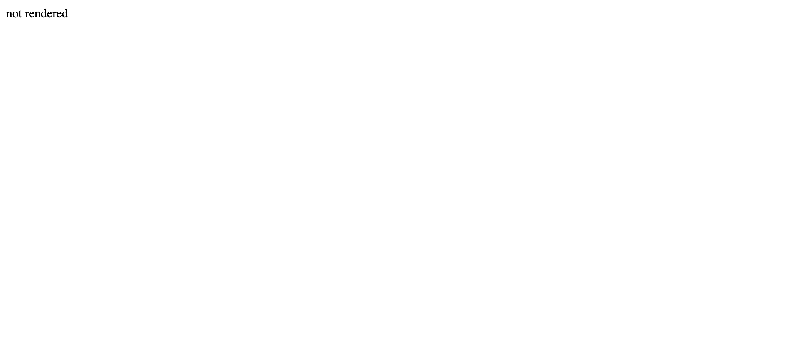
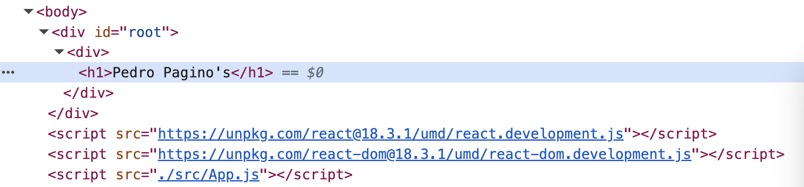

# 02. React without a Build Step

- Source code
    
    index.html
    
    ```html
    <!DOCTYPE html>
    <html lang="en">
      <head>
        <meta charset="UTF-8" />
        <meta name="viewport" content="width=device-width, initial-scale=1.0" />
        <title>Padre Gino's</title>
      </head>
    
      <body>
        <div id="root">not rendered</div>
        <script src="https://unpkg.com/react@18.3.1/umd/react.development.js"></script>
        <script src="https://unpkg.com/react-dom@18.3.1/umd/react-dom.development.js"></script>
        <script src="./src/App.js"></script>
      </body>
    </html>
    ```
    
    Explanation:
    
    - `<div id="root">not rendered</div>`
        
        “not rendered” will get replaced, so if you see it you will know that something went wrong
        
    - umd - (Universal Module Definition) is a JavaScript module format designed to work across various environments, including browsers, Node.js, and as global scripts.
    - react - The universal interface for React - React Native, React 3D, React 360
    - react-dom - The actual rendering layer underneath it that is specific to the DOM and the browser - The default package for working in a browser
    - `npx serve`  runs local host server using Node (Vercel)
    
    Initially
    
    
    
    ./src/App.js
    
    ```jsx
    const App = () => {
      return React.createElement(
        "div",
        {},
        React.createElement("h1", {}, "Pedro Pagino's")
      );
    };
    
    const container = document.getElementById("root");
    const root = ReactDOM.createRoot(container);
    root.render(React.createElement(App));
    ```
    
    Explanation:
    
    - [createElement](https://react.dev/reference/react/createElement) - lets you create a React element. It serves as an alternative to writing JSX.
        
        [JSX](https://react.dev/learn/writing-markup-with-jsx) - a syntax extension for JavaScript that lets you write HTML-like markup inside a JavaScript file
        
    - [createRoot](https://react.dev/reference/react-dom/client/createRoot) - lets you create a root to display React components inside a browser DOM node.
    
    > React is all about making components
    > 
    
    We just created an “App stamp” and we can stamp it as many times as we want. It is a reusable component.
    
    ```jsx
    const App = () => {
      return React.createElement(
        "div",
        {},
        React.createElement("h1", {}, "Pedro Pagino's")
      );
    };
    ```
    
    `createElement`  is the action of stamping the stamp
    
    In the “App.js”, we are stamping the stamp once.
    
- Result
    - Page
        
        
        
    - DOM
        
        