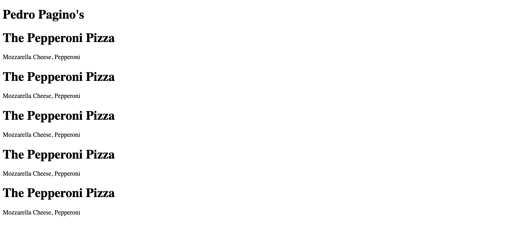
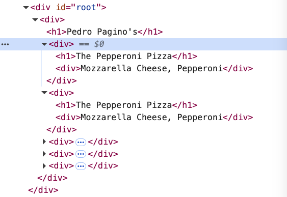
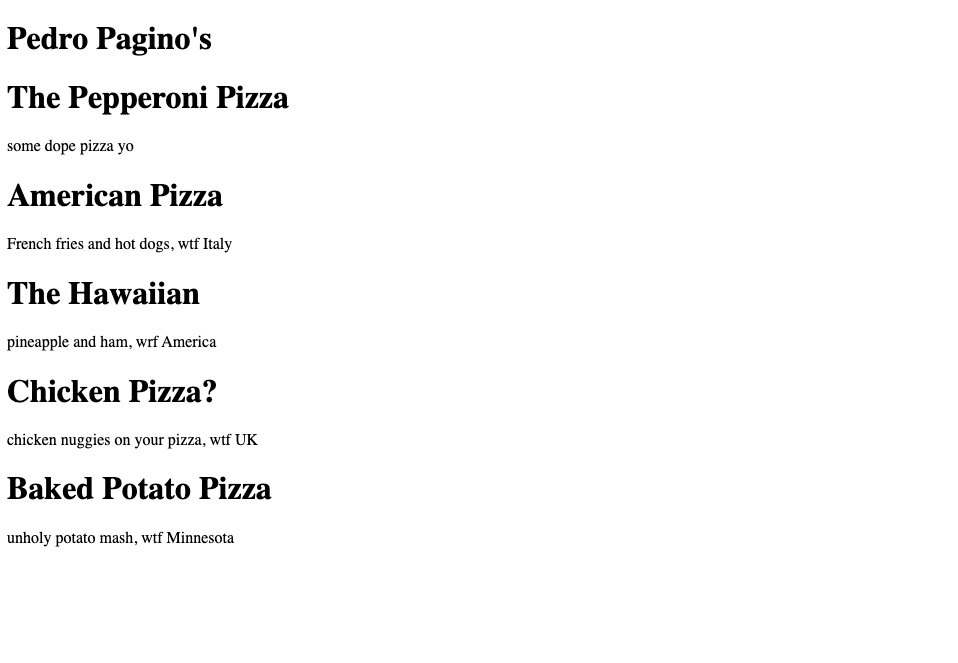
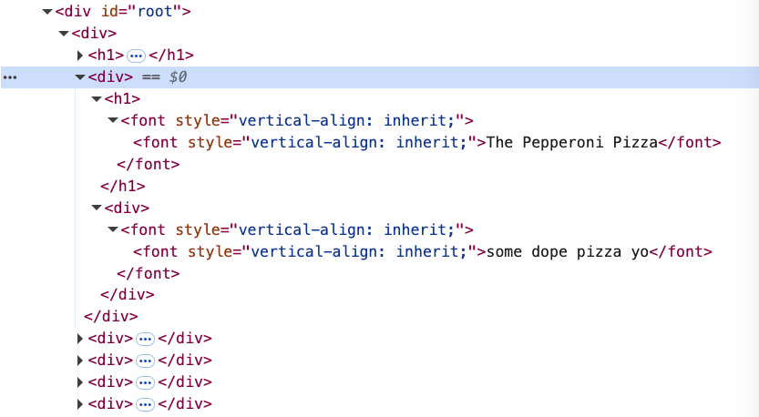

# 03. Vanilla React Components

URL: [https://react-v9.holt.courses/lessons/no-frills-react/components](https://react-v9.holt.courses/lessons/no-frills-react/components)

- **Beginning:**
    
    ```jsx
    const App = () => {
      return React.createElement(
        "div",
        {},
        React.createElement("h1", {}, "Pedro Pagino's")
      );
    };
    ```
    
    
    
- Add multiple Pizzas
    - Step 1: Create **Pizza** component in **App.js**
        
        ```jsx
        // Pizza component
        const Pizza = () => {
          return React.createElement("div", {}, [
            React.createElement("h1", {}, "The Pepperoni Pizza"),
            React.createElement("div", {}, "Mozzarella Cheese, Pepperoni")
          ])
        }
        ```
        
    - Step 2: Update the **App** component with **Pizza** component
        
        ```jsx
        const App = () => {
          return React.createElement(
            "div",
            {},
            [
              React.createElement("h1", {}, "Pedro Pagino's"),
              React.createElement(Pizza),
              React.createElement(Pizza),
              React.createElement(Pizza),
              React.createElement(Pizza),
              React.createElement(Pizza),
            ]
          );
        };
        ```
        
    
    **Result:**
    
    
    



- Add multiple types of Pizza with “*props*” (*properties*)
    - Step 1: Modify **Pizza** component
        
        ```jsx
        const Pizza = (props) => {
          return React.createElement("div", {}, [
            React.createElement("h1", {}, props.name),
            React.createElement("div", {}, props.description)
          ])
        }
        ```
        
    - Step 2: Modify **App** component
        
        ```jsx
        const App = () => {
          return React.createElement(
            "div",
            {},
            [
              React.createElement("h1", {}, "Pedro Pagino's"),
              React.createElement(Pizza, {
                name: "The Pepperoni Pizza",
                description: "some dope pizza yo"
              }),
              React.createElement(Pizza, {
                name: "Americano Pizza",
                description: "French fries and hot dogs, wtf Italy"
              }),
              React.createElement(Pizza, {
                name: "The Hawaiian",
                description: "pineapple and ham, wrf America"
              }),
              React.createElement(Pizza, {
                name: "Chicken Pizza?",
                description: "chicken nuggies on your pizza, wtf UK"
              }),
              React.createElement(Pizza, {
                name: "Baked Potato Pizza",
                description: "unholy potato mash, wtf Minnesota"
              }),
            ]
          );
        };
        ```
        
    - Result
        
        
        
        
        

Check to see the full code version at [**citr-v9-project**/**01-no-frills-react**/](https://github.com/btholt/citr-v9-project/tree/main/01-no-frills-react)