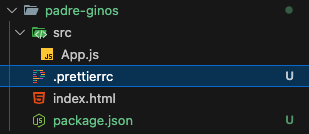

# 04. Prettier

URL: [https://react-v9.holt.courses/lessons/tools/npm](https://react-v9.holt.courses/lessons/tools/npm)

- Start an npm project, run `npm init -y`  at the root of your project
  With the flag “-y” you will not have to answer any question while installing the package
  This will generate the file **package.json** which allows us to save things to the project so that
  - The next developers will get the same version of React we are using for the project. We don’t need to store React on our GitHub.
  - If there is a critical vulnerability with React, they will be able to patch it and the next time you get it you will get the patched version of it.
    
  ```json
  {
    "name": "padre-ginos",
    "version": "1.0.0",
    "main": "index.js",
    "scripts": {
      "test": "echo \"Error: no test specified\" && exit 1"
    },
    "keywords": [],
    "author": "",
    "license": "ISC",
    "type": "commonjs",
    "description": ""
  }
  ```
- Prettier
  - Create prettier config file
    
    An empty object as the configuration means to use all the default
    
    Also make sure to **Format On Save** in setting
    
  - Set up prettier to work with everybody in this project
    - Install prettier with Terminal command line
      ```bash
      npm install --save-dev prettier
      ```
      or shorthand
      ```bash
      npm i -D prettier
      ```
      In the **package.json** we can now see that **prettier** has been installed as a _devDependencies_
      
      ```json
      "devDependencies": {
        "prettier": "^3.5.3"
      }
      ```
      This means that **prettier** is meant to be installed only for _development_ environments, not for _production_ environments.
    - Add this line to the **scripts**
      `"format": "prettier --write \"src/**/*.{js,jsx,css,html}\""`
      ```bash
      "scripts": {
        "format": "prettier --write \"src/**/*.{js,jsx,css,html}\"",
        "test": "echo \"Error: no test specified\" && exit 1"
      },
      ```
    - Finally, run this command line in the Terminal
      ```bash
      npm run format
      ```
      What it does is it will run all this format
      `"prettier --write \"src/**/*.{js,jsx,css,html}\"",`
      And say if you did not change anything to the **App.js** file then it will show (unchanged) in the Terminal
      
