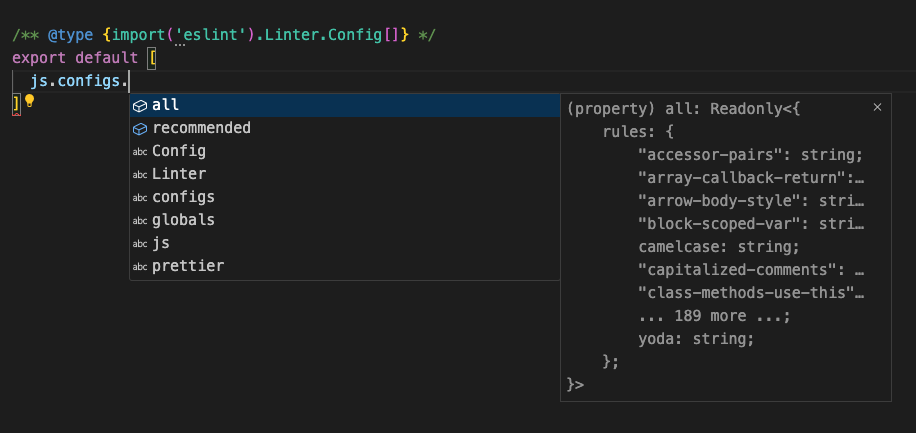
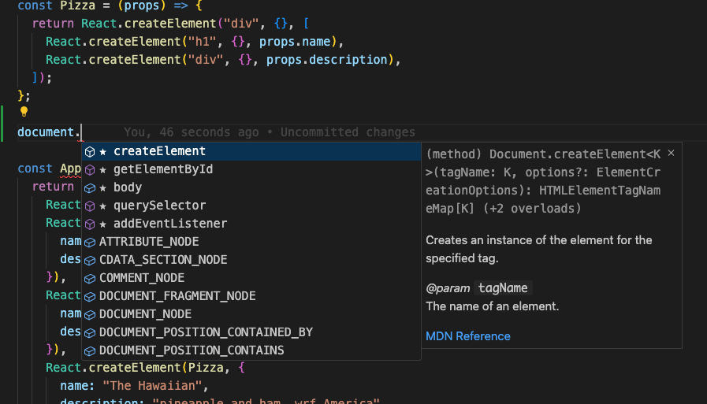
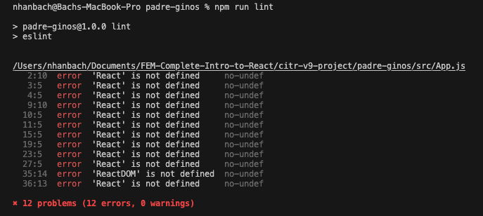
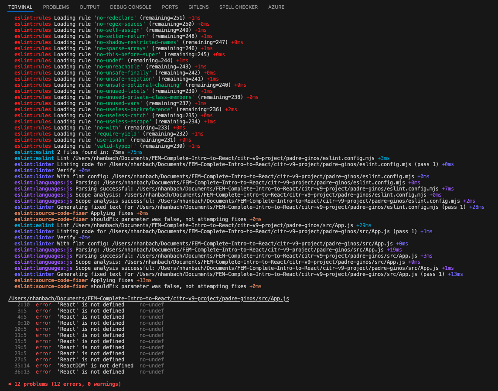
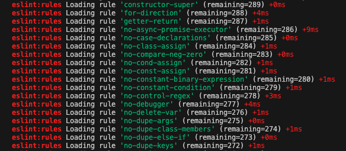
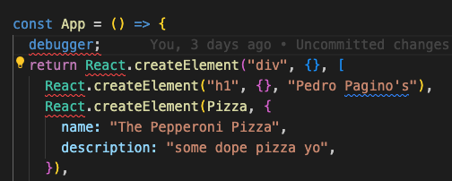
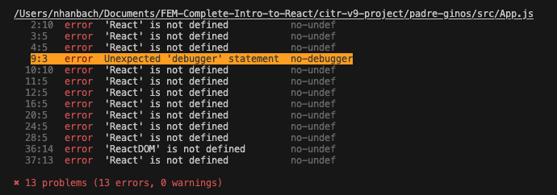
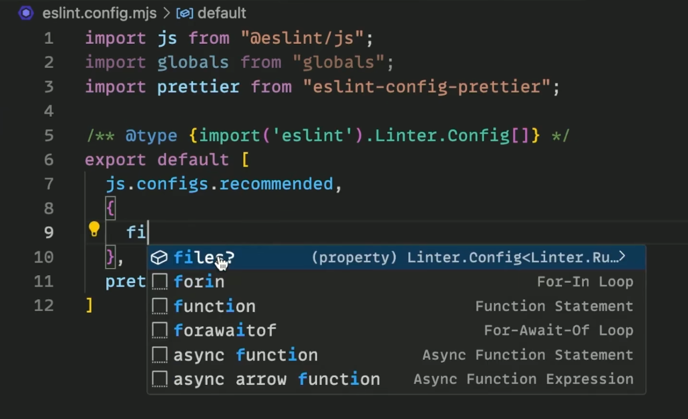

# 05. ESLint

URL: [https://react-v9.holt.courses/lessons/tools/linting](https://react-v9.holt.courses/lessons/tools/linting)

Docs: [https://eslint.org/docs/latest/use/configure/configuration-files](https://eslint.org/docs/latest/use/configure/configuration-files)

- The difference between ESLint and Prettier
    - ESLint - linting, enforcing - much more semantics, syntax and content focused
    - Prettier - formatting - whitespace, newlines
    
    > **format** with prettier, **lint** with ESLint
    > 
- Setting up ESLint
    - `eslint.config.mjs` - use *mjs* for ES modules - **import**/**export** instead of *require*
    - Configuring eslint
        
        ```jsx
        import js from "@eslint/js";
        import globals from "globals";
        import prettier from "eslint-config-prettier";
        
        /** @type {import('eslint').Linter.Config[]} */
        export default [
          js.configs.recommended,
          {
            files: ["**/*.js", "**/*.jsx"],
            languageOptions: {
              globals: { ...globals.browser, ...globals.node },
              parserOptions: {
                ecmaFeatures: {
                  jsx: true,
                },
              },
            },
          },
          prettier,
        ];
        ```
        
        Explanation:
        
        - The lower a configuration is in the list, the last it is executed.
            
            **prettier** config always has to be the *last*, all it does is turn off stuff (formatting, new lines,….), it does not add anything new
            
        - Type completion trick (this one is related to VS Code and TypeScript, even though this project is not TypeScript)
            
            `/** @type {import ('eslint').Linter.Config[]} */` 
            
            VS Code will give the type completions for all the type that comes after this comment
            
            Note: This trick would only work for VS Code
            
        - `js.configs.recommended`  - it is best to go for the *recommended* configs, otherwise if you don’t know what you need then *all* is not very helpful.
            
            
            
        - Specifying our [**Configuration Objects**](https://eslint.org/docs/latest/use/configure/configuration-files#configuration-objects)
            - Specifying the files: `files: ["**/*.js", "**/*.jsx"],`
                
                Read more at [**Specifying `files` and `ignores`**](https://eslint.org/docs/latest/use/configure/configuration-files#specifying-files-and-ignores)
                
            - [languageOptions](https://eslint.org/docs/latest/use/configure/language-options)
                - [Specifying Globals](https://eslint.org/docs/latest/use/configure/language-options#specifying-globals): `...globals.browser, ...globals.node`  - The union of **browser** and **node**
                    
                    VS Code will know what **document** is because it is global to the environment.
                    
                    
                    
                - [Specifying Parser Options](https://eslint.org/docs/latest/use/configure/language-options#specifying-parser-options):
                    
                    ```jsx
                    parserOptions: {
                      ecmaFeatures: {
                        jsx: true,
                      },
                    },
                    ```
                    
                    `ecmaFeatures` - an object indicating which additional language features you’d like to use:
                    
                    - `globalReturn` - allow `return` statements in the global scope.
                    - `impliedStrict` - enable global [strict mode](https://developer.mozilla.org/en-US/docs/Web/JavaScript/Reference/Strict_mode) (if `ecmaVersion` is `5` or greater).
                    - `jsx` - enable [JSX](https://facebook.github.io/jsx/).
            - Configure **package.json**
                
                Add `"lint": "eslint"`  to the “scripts”
                
                ```jsx
                "scripts": {
                  "format": "prettier --write \"src/**/*.{js,jsx,css,html}\"",
                  "lint": "eslint",
                  "test": "echo \"Error: no test specified\" && exit 1"
                },
                ```
                
            - Linting and Debugging with ESLint
                - Linting
                    
                    ```jsx
                    npm run lint
                    ```
                    
                    
                    
                - Debugging
                    
                    ```jsx
                    npm run lint -- --debug
                    ```
                    
                    - The double dashes “—” are used for passing `—debug`  into the “lint”
                    - Without the double dashes “—”, it is going to apply **debug** into **npm** which does not make sense.
                    
                    
                    
                    These are the rules that are loading
                    
                    
                    
                    Say if we use the keyword “**debugger**”, it will invoke any available debugging functionality - Read more about [debugger](https://developer.mozilla.org/en-US/docs/Web/JavaScript/Reference/Statements/debugger)
                    
                    **App.js**
                    
                    
                    
                    ESLint will output this when debugging the code
                    
                    
                    
- Question:
    - How can you get the file eslint.config.mjs to show this suggestion for you?
        
        
        
    - Is the purpose of the npm script that you wrote only if somebody does not have prettier installed in their computer?
        
        Answer:
        
        The chief reason is you can now run it in CI CD, run it as a GitHub action, so you won’t deploy your code if it fails lint or prettier.