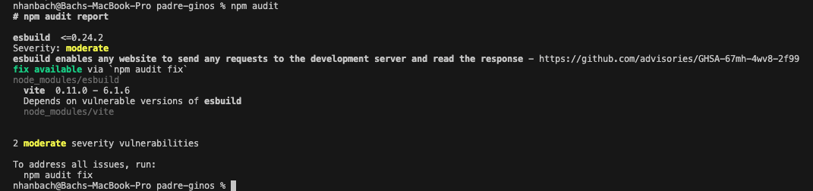

# 07. Vite

URL: [https://react-v9.holt.courses/lessons/tools/vite](https://react-v9.holt.courses/lessons/tools/vite)

Official page: [https://vite.dev/](https://vite.dev/)

Also check out:
- [Rollup](https://rollupjs.org/)
- [Rolldown](https://rolldown.rs/)
- [Parcel](https://parceljs.org/)
- [Webpack](https://webpack.js.org/)

- Install Vite in the Terminal
    
    ```bash
    npm install -D vite@5.4.2 @vitejs/plugin-react@4.3.1
    ```
    
- Config Vite for React project
    
    **index.html**
    
    ```html
    <!DOCTYPE html>
    <html lang="en">
    <head>
      <meta charset="UTF-8">
      <meta name="viewport" content="width=device-width, initial-scale=1.0">
      <title>Padre Ginos</title>
    </head>
    <body>
      <div id="root">not rendered</div>
      <!-- Remove the two unpkg scripts -->
      <script type="module" src="./src/App.js"></script>
    </body>
    </html>
    ```
    
    Adding `type=”module”`  attribute to the `<script>`  tag to let Vite knows that you are going to be working with *modules*
    
    > Vite does **not** work with **common JS**, it **only** works with **modules**
    > 
    
    **vite.config.js**
    
    
    
    
    
    ```jsx
    import { defineConfig } from "vite";
    import react from "@vitejs/plugin-react";
    
    export default defineConfig({
    	plugins: [react()]
    })
    ```
    
    **[react()]** tells Vite that this is a React project and that Vite will have to do React type things.
    
- Install **production dependencies**
    - VS Code Terminal
        
        ```bash
        npm i react@18.3.1 react-dom@18.3.1
        ```
        
        **Notes:
        -** The difference between installing **production** and **dev** dependencies lies in the “**-D**”
        - We are doing React 18 instead of 19 because React 19 is still not officially stable (it is in release candidate). However, everything that is used in this React 18 course is tested and is guaranteed 100% to work in React 19 as well!
        - You can expect to have **security vulnerability** which is absolutely normal
        
        
        
        You can try with `npm audit`  but just keep in mind that those security vulnerability are quite normal to be had
        
        
        
        You can also try to fix them with `npm audit fix`  which sometimes it can actually fix something
        
        
        
    - Check for the new dependencies in **package.json**
        
        
        
        **react** and **react-dom** are installed as **production** **dependencies** below devDependencies
        
- Adjustment
    - **App.js**
        
        Since you already removed the two **unpkg** scripts in **index.html** file, React is no longer available in our project. Therefore, now you need to **import** React inside the **App.js** file.
        
        ```jsx
        const Pizza = (props) => {
        	...
        }
        
        const App = () => {
        	...
        }
        
        const container = document.getElementById("root");
        const root = ReactDOM.createRoot(container);
        root.render(React.createElement(App));
        ```
        
        
        
        
        
        There are two things you are using in this file which are
        - React (library)
        - ReactDOM (package) - *createRoot* method
        
        Those keywords are underlined in red because those libraries are currently not available for use in the file
        
    - Your file after applying the changes will look something like this
        
        ```jsx
        import React from "react";
        import { createRoot } from "react-dom";
        
        const Pizza = (props) => {
        	...
        }
        
        const App = () => {
        	...
        }
        
        const container = document.getElementById("root");
        const root = createRoot(container);
        root.render(React.createElement(App));
        ```
        
        Explanation:
        - `import React from "react";` : import the entire “React” library
        - `import { createRoot } from "react-dom";` : import **only** the “**createRoot**” method from the “react-dom” package. This is like the destructuring syntax in JavaScript.
        
        **Note:** The old way of writing `from “react-dom”`  is `“from react-dom/client”` . This works for React 18 and older but might break for React 19 and later.
        
        If you import **createRoot** method on the top of the file but you don’t remove it from your code down the file, JavaScript will show “**createRoot is declared but its value is never read**”
        
        
        
        
        
        Once you import the necessary resources, those errors will disappear
        
    - Lint
        
        With the necessary resources installed, ESLint now has stopped showing errors
        
        ```bash
        npm run lint
        ```
        
        
        
    - **package.json**
        
        Current
        
        ```bash
        .
        // other configs
        .
        "scripts": {
          "format": "prettier --write \"src/**/*.{js,jsx,css,html}\"",
          "lint": "eslint",
          "test": "echo \"Error: no test specified\" && exit 1"
        },
        "keywords": [],
        "author": "",
        .
        .
        // other configs
        .
        ```
        
        Updated
        
        ```bash
        .
        // other configs
        .
        "scripts": {
          "dev": "vite",
          "build": "vite build",
          "preview": "vite preview",
          "format": "prettier --write \"src/**/*.{js,jsx,css,html}\"",
          "lint": "eslint",
          "test": "echo \"Error: no test specified\" && exit 1"
        },
        "keywords": [],
        "type": "module",
        "author": "",
        .
        .
        // other configs
        .
        ```
        
        **Remember:** The order is not important
        
        Explanation:
        
        - [vite](https://vite.dev/guide/cli.html#vite): Start Vite dev server in the current directory
        - [vite build](https://vite.dev/guide/cli.html#vite-build): Build for production.
        Build the project into static assets that you could ship off to Vercel or AWS or Netlify or Fly, and you could serve those from there.
        - [vite preview](https://vite.dev/guide/cli.html#vite-preview): Locally preview the production build. Do not use this as a production server as it's not designed for it.
        It will build the project in terms of production and then serve it to you as if it was a production box to help you kind of figure out those problems.
        - `"type": "module",` : This will tell any tool that uses your project that the project uses “ES modules” (import/export style) as opposed to using common JS (required style).
    - Running local Vite
        
        ```bash
        npm run dev
        ```
        
        
        
        What is 5173? In Roman numerals, 5173 = VITE (humorously interpreted)
        
        