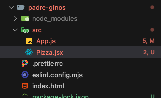
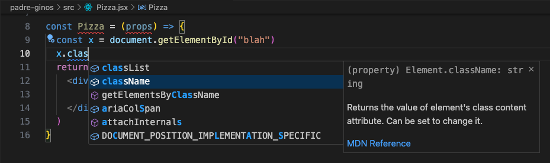
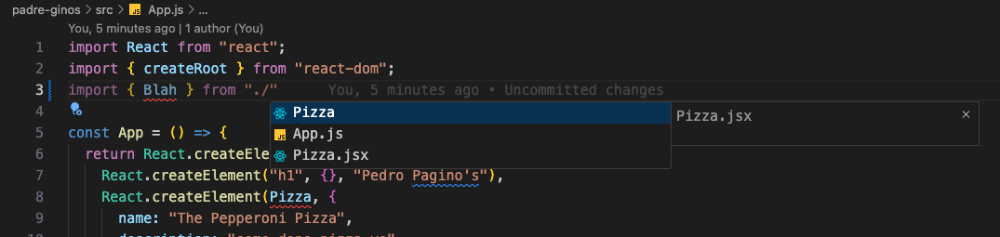

# 08. JSX

URL: [https://react-v9.holt.courses/lessons/core-react-concepts/jsx](https://react-v9.holt.courses/lessons/core-react-concepts/jsx)

Official docs: [https://react.dev/learn/writing-markup-with-jsx](https://react.dev/learn/writing-markup-with-jsx)

- Timeline review
    - First: JavaScript inside HTML
    - Then: Mimics HTML in React
        
        ```jsx
        React.createElement("h1", { id: "main-title" }, "My Website");
        ```
        
        which creates
        
        ```jsx
        <h1 id="main-title">My Website</h1>
        ```
        
    - Now: JSX
- **Pizza.jsx** (reuse data from App.js)
    
    
    
    - This is how you mimic HTML using React
        
        ```jsx
        const Pizza = (props) => {
          return React.createElement("div", {}, [
            React.createElement("h1", {}, props.name),
            React.createElement("div", {}, props.description),
          ]);
        };
        
        export default Pizza;
        ```
        
    - This is JSX in React
        
        ```jsx
        const Pizza = (props) => {
        	return (
        		<div className="pizza">
        			<h1>{props.name}</h1>
        			<p>{props.description}</p>
        		</div>
        	)
        };
        
        export default Pizza;
        ```
        
        Explanation:
        
        - className
            
            The reason that you need to use *className* instead of just *class* is because *class* is the reserved word in JavaScript
            
            The way that you would get the class name of something in React in *className*
            
            
            
        - JavaScript expression: `{props.name}`  and `{props.description}`
            - It is anything that is surrounded with curly braces
            - It is anything that is on the right side of an equal sign
                
                Example: `document.getElementById("blah")`  is an expression
                
                ```jsx
                const x = document.getElementById("blah")
                ```
                
- import React then and now
    
    Whenever you use React in your project file, you used to have to `import React from “react";` 
    
    ```jsx
    import React from "react";
    
    const Pizza = (props) => {
    	return (
    		<div className="pizza">
    			<h1>{props.name}</h1>
    			<p>{props.description}</p>
    		</div>
    	)
    };
    
    export default Pizza;
    ```
    
    But that is not the case anymore, the tool is now smart enough that if it sees if you are using “jsx” file, it will automatically import React for you
    
    ```jsx
    const Pizza = (props) => {
    	return (
    		<div className="pizza">
    			<h1>{props.name}</h1>
    			<p>{props.description}</p>
    		</div>
    	)
    };
    
    export default Pizza;
    ```
    
- import / export component
    - Default import / export
        
        Say you want to use component Pizza in file **Pizza.jsx** inside **App.js**
        
        **Pizza.jsx**
        
        ```jsx
        const Pizza = (props) => {
        	return (
        		<div className="pizza">
        			<h1>{props.name}</h1>
        			<p>{props.description}</p>
        		</div>
        	)
        };
        
        export default Pizza;
        ```
        
        **App.js**
        
        ```jsx
        import React from "react";
        import { createRoot } from "react-dom";
        import Pizza from "./Pizza"
        
        const App = () => {
          ...
        };
        
        const container = document.getElementById("root");
        const root = createRoot(container);
        root.render(React.createElement(App));
        ```
        
    - Named export
        
        This allows you to export and import multiple components
        
        - Single component
            
            **Pizza.jsx**
            
            ```jsx
            export const Pizza = (props) => {
            	return (
            		<div className="pizza">
            			<h1>{props.name}</h1>
            			<p>{props.description}</p>
            		</div>
            	)
            };
            ```
            
            **App.js**
            
            Import component **Pizza** from **Pizza.jsx** with `import { Pizza } from "./Pizza.jsx"`
            
            ```jsx
            import React from "react";
            import { createRoot } from "react-dom";
            import { Pizza } from "./Pizza"
            
            const App = () => {
              ...
            };
            
            const container = document.getElementById("root");
            const root = createRoot(container);
            root.render(React.createElement(App));
            ```
            
        - Multiple components
            
            **Pizza.jsx**
            
            ```jsx
            export const Pizza = (props) => {
            	return (
            		<div className="pizza">
            			<h1>{props.name}</h1>
            			<p>{props.description}</p>
            		</div>
            	)
            };
            
            export const Blah = () => <h1>blah</h1>;
            ```
            
            **App.js**
            
            Import component **Pizza** and **Blah** from **Pizza.jsx** with `import { Pizza, Blah } from "./Pizza.jsx"`
            
            ```jsx
            import React from "react";
            import { createRoot } from "react-dom";
            import { Pizza, Blah } from "./Pizza"
            
            const App = () => {
              ...
            };
            
            const container = document.getElementById("root");
            const root = createRoot(container);
            root.render(React.createElement(App));
            ```
            
            On the other hand, `import { Pizza }, Blah from "./Pizza.jsx"`  will work just fine as well
            
            With that being said, if you export the component using **named export**, you need to surround the component name in curly braces when you import it
            
            **Pizza.jsx**
            
            ```jsx
            export const Blah = () => <h1>blah</h1>;
            ```
            
            **App.js**
            
            ```jsx
            import { Blah } from "./Pizza"
            ```
            
            
            
    
    Which one is better between **default export** vs. **named export**? Neither! It just depends on personal preferences.
    
    If you are a “one file one component” kind of person, the default export will work just fine for you.